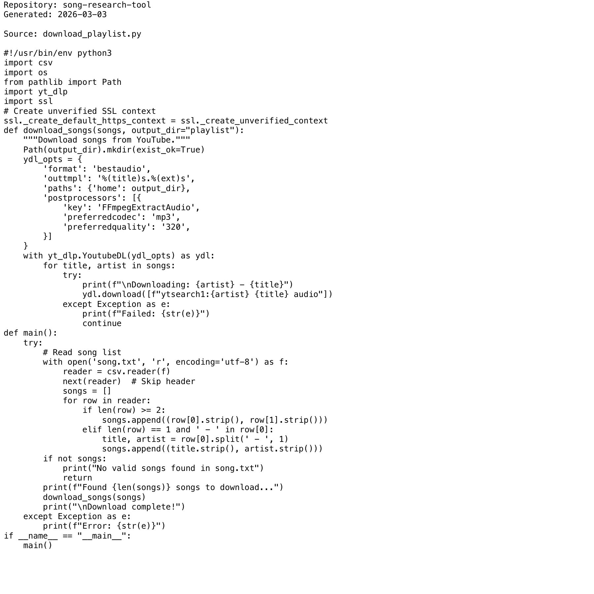

# Project Narrative & Proof

Generated: 2026-03-03

## User Journey
1. Discover the project value in the repository overview and launch instructions.
2. Run or open the build artifact for song-research-tool and interact with the primary experience.
3. Observe output/behavior through the documented flow and visual/code evidence below.
4. Reuse or extend the project by following the repository structure and stack notes.

## Design Methodology
- Iterative implementation with working increments preserved in Git history.
- Show-don't-tell documentation style: direct assets and source excerpts instead of abstract claims.
- Traceability from concept to implementation through concrete files and modules.

## Progress
- Latest commit: aa9194c (2026-03-03) - docs: add professional README with badges
- Total commits: 2
- Current status: repository has baseline narrative + proof documentation and CI doc validation.

## Tech Stack
- Detected stack: Node.js, Python, GitHub Actions, TypeScript, JavaScript, HTML/CSS

## Main Key Concepts
- Key module area: `node_modules`
- Key module area: `song-research-ui`
- Key module area: `src`
- Key module area: `venv`

## What I'm Bringing to the Table
- End-to-end ownership: from concept framing to implementation and quality gates.
- Engineering rigor: repeatable workflows, versioned progress, and implementation-first evidence.
- Product clarity: user-centered framing with explicit journey and value articulation.

## Show Don't Tell: Screenshots


## Show Don't Tell: Code Excerpt
Source: `download_playlist.py`

```py
#!/usr/bin/env python3
import csv
import os
from pathlib import Path
import yt_dlp
import ssl
# Create unverified SSL context
ssl._create_default_https_context = ssl._create_unverified_context
def download_songs(songs, output_dir="playlist"):
    """Download songs from YouTube."""
    Path(output_dir).mkdir(exist_ok=True)
    ydl_opts = {
        'format': 'bestaudio',
        'outtmpl': '%(title)s.%(ext)s',
        'paths': {'home': output_dir},
        'postprocessors': [{
            'key': 'FFmpegExtractAudio',
            'preferredcodec': 'mp3',
            'preferredquality': '320',
        }]
    }
    with yt_dlp.YoutubeDL(ydl_opts) as ydl:
        for title, artist in songs:
            try:
                print(f"\nDownloading: {artist} - {title}")
                ydl.download([f"ytsearch1:{artist} {title} audio"])
            except Exception as e:
                print(f"Failed: {str(e)}")
                continue
def main():
    try:
        # Read song list
        with open('song.txt', 'r', encoding='utf-8') as f:
            reader = csv.reader(f)
            next(reader)  # Skip header
```
